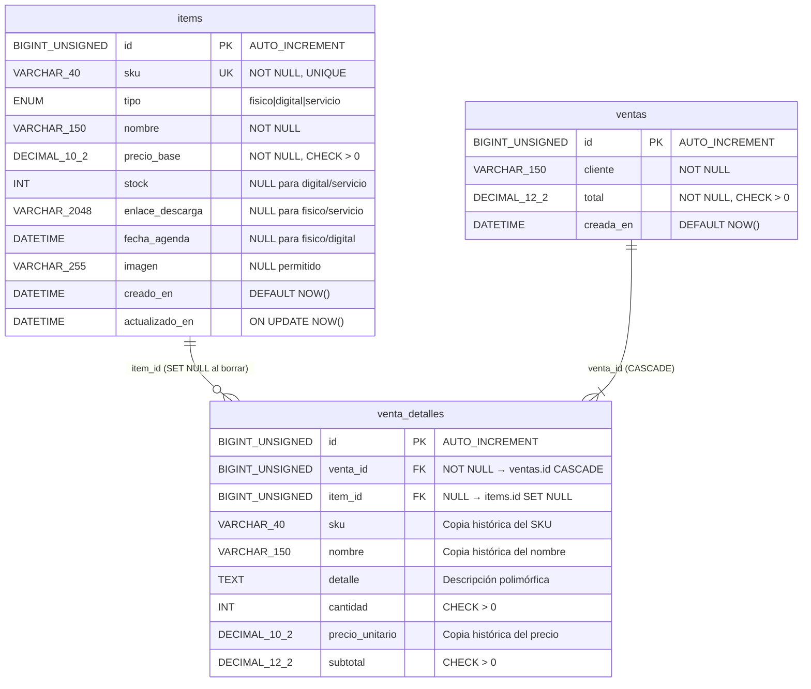
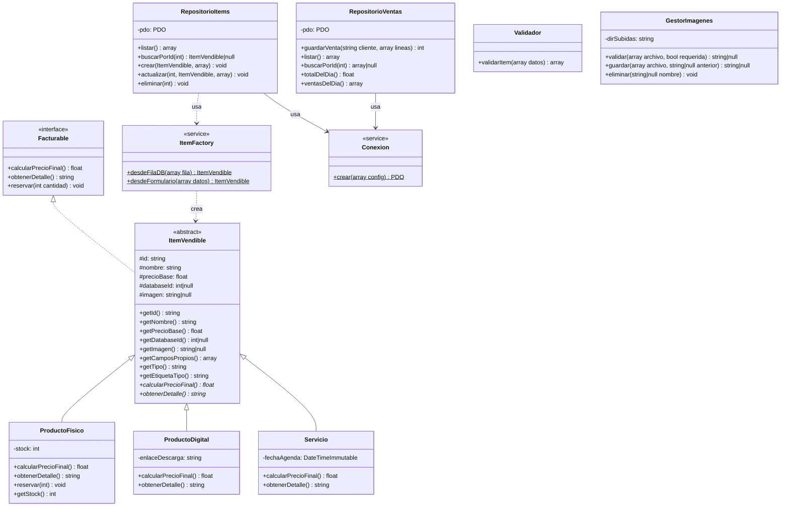

# Informe Técnico — Caso B: Punto de Venta Web
## Fase 2: Aplicación Web PHP

**Curso:** Programación Orientada a Objetos en PHP  
**Periodo:** 2 · 2026  
**Integrantes:**
| Nombre | Carné / Usuario GitHub | Rama |
|--------|----------------------|------|
| Miguel | `Miguel` | `Miguel` |
| Diego  | `Diego`  | `Diego`  |
| Kendel Jhoel | `KendelJhoel` | `ken` |
| Rodolfo Rivas | `FOFOCode` | `Rodolfo` |

---

## 1. Descripción del Proyecto

El Caso B extiende el sistema de punto de venta por consola de la Fase 1 hacia una aplicación web completa con persistencia en MySQL. El sistema mantiene retrocompatibilidad con la interfaz de consola original y añade:

- CRUD completo del catálogo desde el navegador
- Registro de ventas con transacción SQL y control de stock
- Tickets históricos que no cambian si se edita el catálogo
- Reporte diario de ventas por tipo de producto
- Seguridad: CSRF, PRG, escape HTML, consultas preparadas, validación en dos capas

---

## 2. Cambios Respecto a la Fase 1 (Consola)

| Aspecto | Fase 1 (Consola) | Fase 2 (Web) |
|---------|------------------|--------------|
| Persistencia | Arrays en memoria | MySQL/MariaDB con PDO |
| Interfaz | Terminal interactivo | 10 páginas HTML5 |
| Catálogo | Hardcodeado en `main.php` | CRUD completo desde el navegador |
| Ventas | Carrito + ticket `.txt` | Transacción SQL + ticket HTML histórico |
| Imágenes | No aplica | Subida, validación MIME, nombre único |
| Seguridad | No aplica | CSRF, PRG, escape, consultas preparadas |
| Clases POO | Sin cambios | Extendidas con `ItemFactory`, `Validador`, `GestorImagenes`, repositorios PDO |

---

## 3. Diagrama Entidad-Relación

### Restricciones de integridad destacadas

- **`chk_items_tipo`**: Un `CHECK` de MySQL garantiza que cada tipo tenga exactamente sus columnas propias no nulas:
  - `fisico`: `stock >= 0`, `enlace_descarga IS NULL`, `fecha_agenda IS NULL`
  - `digital`: `stock IS NULL`, `enlace_descarga NOT NULL`
  - `servicio`: `stock IS NULL`, `enlace_descarga IS NULL`, `fecha_agenda NOT NULL`
- **`item_id ON DELETE SET NULL`**: Borrar un producto del catálogo pone `item_id = NULL` en los detalles de venta, pero conserva `sku`, `nombre` y `precio_unitario` copiados, por lo que el ticket histórico no cambia.

---

## 4. Justificación: Una Tabla para la Jerarquía (`Table Per Hierarchy`)

Se eligió la estrategia **una única tabla `items`** para mapear la jerarquía `ItemVendible → {ProductoFisico, ProductoDigital, Servicio}` por las siguientes razones:

| Criterio | Una tabla (`TPH`) | Tabla por subclase (`TPS`) |
|----------|------------------|---------------------------|
| Consultas de listado | `SELECT * FROM items` | `UNION` de tres tablas |
| Polimorfismo en BD | Columna `tipo` + `CHECK` | Joins o UNIONs |
| Complejidad del esquema | Baja (1 tabla, 1 FK) | Alta (3 tablas, múltiples FKs) |
| Nulos en columnas | Algunos nulos controlados por `CHECK` | Sin nulos, pero más tablas |
| Adecuado para ejercicio académico | ✔ | Sobreingeniería |

`ItemFactory` reconstruye la subclase correcta al leer cada fila, consultando la columna `tipo`.

---

## 5. Diagrama de Clases

---

## 6. Correspondencia Clases ↔ Tablas

| Clase PHP | Tabla MySQL | Columna discriminadora | Notas |
|-----------|-------------|----------------------|-------|
| `ItemVendible` | `items` | `tipo` | Clase abstracta; no se instancia directamente |
| `ProductoFisico` | `items` | `tipo = 'fisico'` | Usa columna `stock` |
| `ProductoDigital` | `items` | `tipo = 'digital'` | Usa columna `enlace_descarga` |
| `Servicio` | `items` | `tipo = 'servicio'` | Usa columna `fecha_agenda` |
| `RepositorioVentas` (venta) | `ventas` | — | Un registro por transacción |
| `RepositorioVentas` (detalle) | `venta_detalles` | — | N registros por venta |

---

## 7. Tabla de Validaciones Cliente / Servidor / Base de Datos

| Campo | Navegador HTML5 | Servidor PHP (`Validador`) | Base de datos (MySQL) |
|-------|----------------|--------------------------|----------------------|
| SKU | `required`, `pattern="[A-Za-z0-9_-]{1,40}"` | Formato regex, no vacío, único | `VARCHAR(40) NOT NULL UNIQUE` |
| Nombre | `required`, `maxlength="150"` | No vacío, max 150 chars | `VARCHAR(150) NOT NULL`, `CHECK CHAR_LENGTH > 0` |
| Precio | `type="number"`, `min="0.01"`, `step="0.01"` | Positivo, 2 decimales, ≤ 99 999 999.99 | `DECIMAL(10,2) NOT NULL`, `CHECK > 0` |
| Stock (físico) | `type="number"`, `min="0"`, `step="1"` | Entero ≥ 0 | `INT NULL`, `CHECK >= 0` en restricción de tipo |
| Enlace (digital) | `type="url"`, `maxlength="2048"` | URL válida HTTP/HTTPS | `VARCHAR(2048) NULL`, restricción de tipo |
| Fecha agenda (servicio) | `type="datetime-local"` | Fecha futura válida | `DATETIME NULL`, restricción de tipo |
| Imagen | `accept="image/*"`, `required` al crear | MIME real (finfo), ≤ 2 MB, JPG/PNG/WEBP | Ruta `VARCHAR(255) NULL` |
| Cliente (venta) | `required`, `maxlength="150"` | No vacío | `VARCHAR(150) NOT NULL`, `CHECK` |
| Cantidad (venta) | `type="number"`, `min="1"` | Entero ≥ 1, stock disponible | `CHECK > 0` en `venta_detalles` |

---

## 8. Los Cuatro Pilares de la POO

| Pilar | Dónde se aplica | Etiqueta en código |
|-------|----------------|-------------------|
| **Abstracción** | `ItemVendible` define el contrato de todo ítem (SKU, nombre, precio, tipo) sin implementar `calcularPrecioFinal()` | `[ABSTRACCION]` |
| **Encapsulamiento** | Propiedades `protected readonly` en `ItemVendible`; invariantes validados en el constructor; ningún código externo puede dejar un objeto en estado inválido | `[ENCAPSULAMIENTO]` |
| **Herencia** | `ProductoFisico`, `ProductoDigital` y `Servicio` heredan de `ItemVendible` y sobrescriben `calcularPrecioFinal()` y `obtenerDetalle()` | `[HERENCIA]` |
| **Polimorfismo** | El listado, el ticket y el reporte llaman a `calcularPrecioFinal()` y `obtenerDetalle()` sobre `ItemVendible` sin saber el subtipo; la vista nunca usa `instanceof` | `[POLIMORFISMO]` |

Además:
- **Interfaz:** `Facturable` define el contrato que deben cumplir todos los ítems. `[INTERFAZ]`
- **Fábrica:** `ItemFactory::desdeFilaDB()` reconstruye la subclase correcta al leer MySQL. `[FABRICA]`
- **Inyección de dependencias:** `RepositorioItems(PDO $pdo)` recibe el PDO por constructor. `[INYECCION-DEPENDENCIAS]`

---

## 9. Distribución Real del Trabajo

| Integrante | Commits | Aporte principal |
|------------|---------|-----------------|
| Miguel | #1 – #5 | Esquema SQL, PDO, fábrica, repositorio de ítems, validador |
| Diego | #6 – #10 | Layout web, catálogo, ficha, alta/edición/borrado, imágenes |
| Kendel Jhoel | #11 – #15 | Repositorio de ventas, cobro web, ticket, reporte, pruebas |
| Rodolfo Rivas | #16 – #20 | README, auditoría de seguridad, capturas, informe, `v2.0` |

---

## 10. Conclusiones y Respuestas para la Defensa

### ¿Por qué una sola tabla `items`?

Simplifica las consultas de listado (`SELECT * FROM items`) y mantiene la FK en `venta_detalles` apuntando a un solo lugar. La columna `tipo` más las restricciones `CHECK` garantizan que cada fila tenga exactamente los campos correctos para su subclase.

### ¿Cómo se preserva el ticket histórico?

La tabla `venta_detalles` copia `sku`, `nombre` y `precio_unitario` al momento de la venta. La FK `item_id` se pone a `NULL` con `ON DELETE SET NULL` si el ítem se elimina, pero los datos históricos permanecen intactos.

### ¿Cómo funciona el patrón Fábrica?

`ItemFactory::desdeFilaDB(array $fila)` lee la columna `tipo` y construye el objeto de la subclase correcta (`ProductoFisico`, `ProductoDigital` o `Servicio`), pasando solo los campos que corresponden a cada constructor. Esto es el único lugar del sistema donde existe lógica de tipo explícita.

### ¿Cómo se implementa PRG?

Cada formulario `POST` ejecuta la lógica de negocio y redirige con `HTTP 303` a una página `GET`. Si el usuario recarga, solo se repite el `GET`; el `POST` no se ejecuta dos veces. La función `redirigir()` en `_init.php` envía el encabezado y llama a `exit`.

### ¿Cómo funciona la protección CSRF?

Se genera un token aleatorio de 32 bytes en la sesión del usuario (`$_SESSION['_csrf']`). Cada formulario incluye un campo oculto con ese token. Antes de procesar cualquier `POST`, `exigirCsrf()` compara el token enviado con el de la sesión usando `hash_equals()` (tiempo constante) y devuelve HTTP 403 si no coinciden.

---

## 11. Dificultades Encontradas

- **Acentos en SQL**: Al importar en Windows con PowerShell, canalizar `Get-Content` altera la codificación. Solución: usar `mysql < archivo.sql` directamente o `docker cp` + `source`.
- **Imágenes huérfanas**: Si la inserción en la BD falla después de guardar el archivo, queda una imagen sin referencia. Solución: validar y guardar la imagen solo si la BD responde OK (orden de operaciones en `GestorImagenes`).
- **Stock en rollback**: Si la venta falla a mitad de la transacción, el stock no debe descontarse. Solución: `BEGIN TRANSACTION` + `ROLLBACK` en `RepositorioVentas::guardarVenta()`.

---

*Documento generado el 01/10/2026 como fuente editable para el informe final en PDF.*
