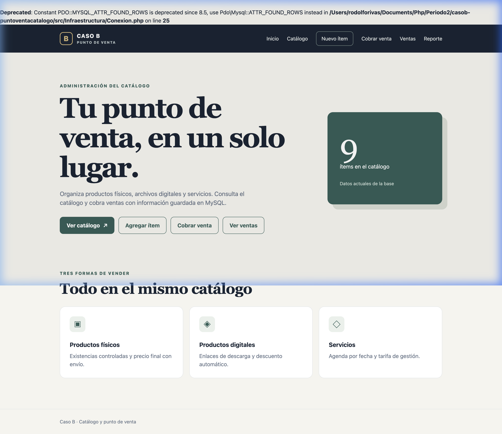
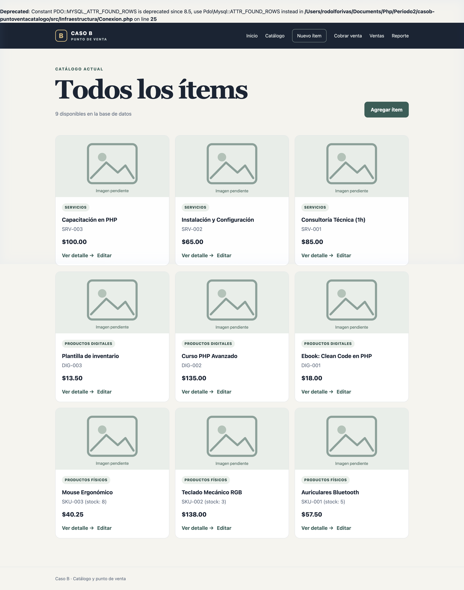
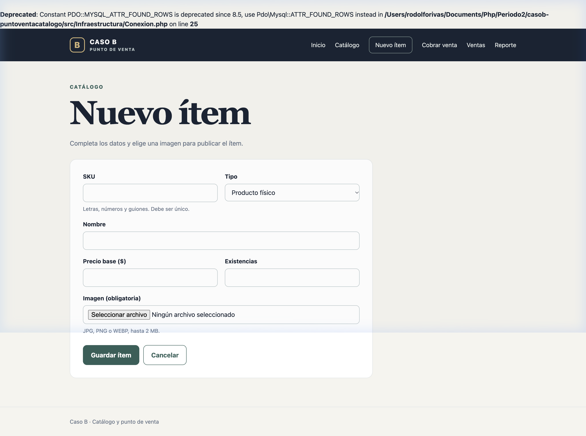
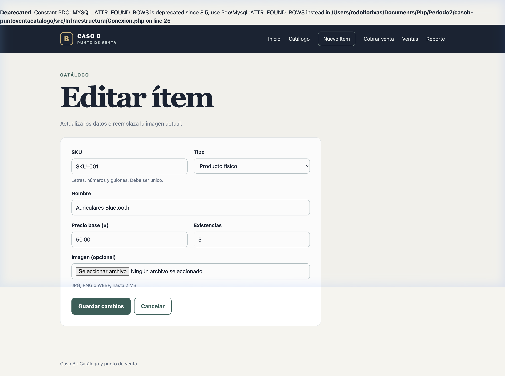
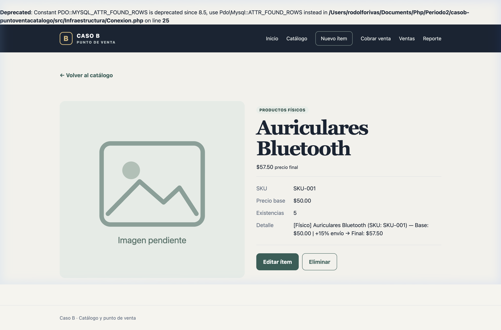
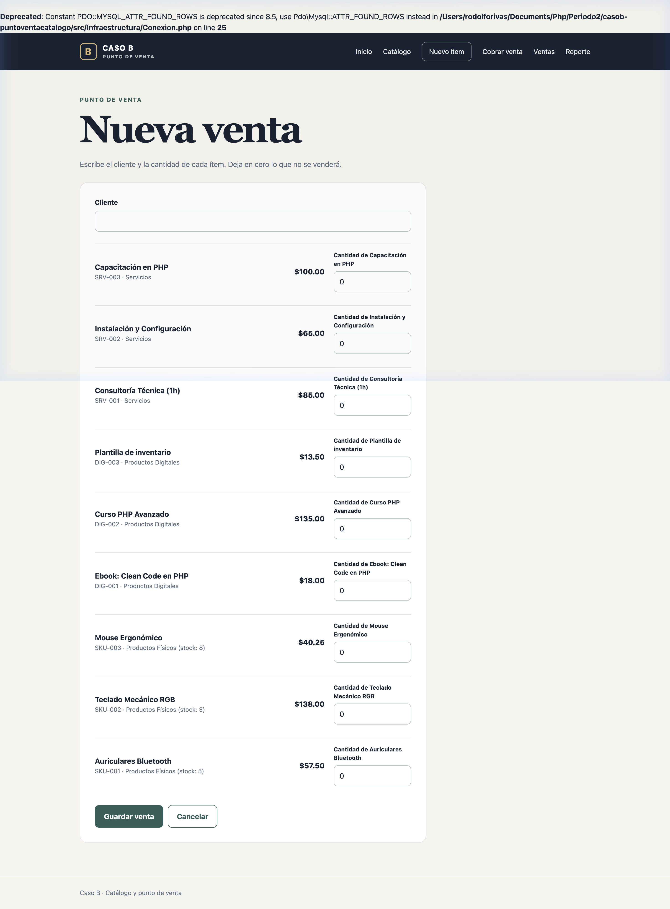
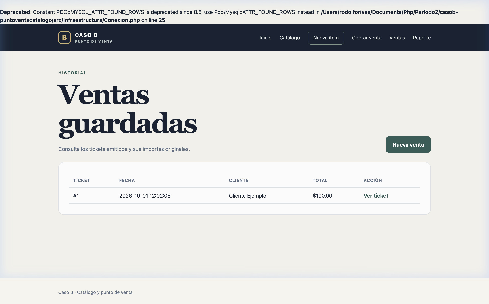
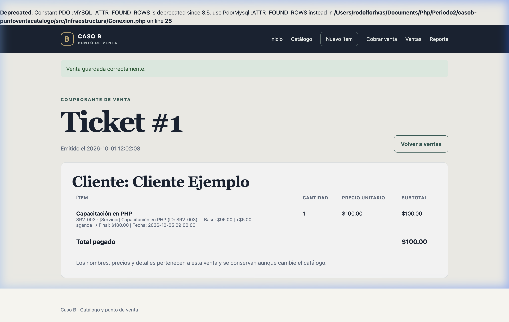
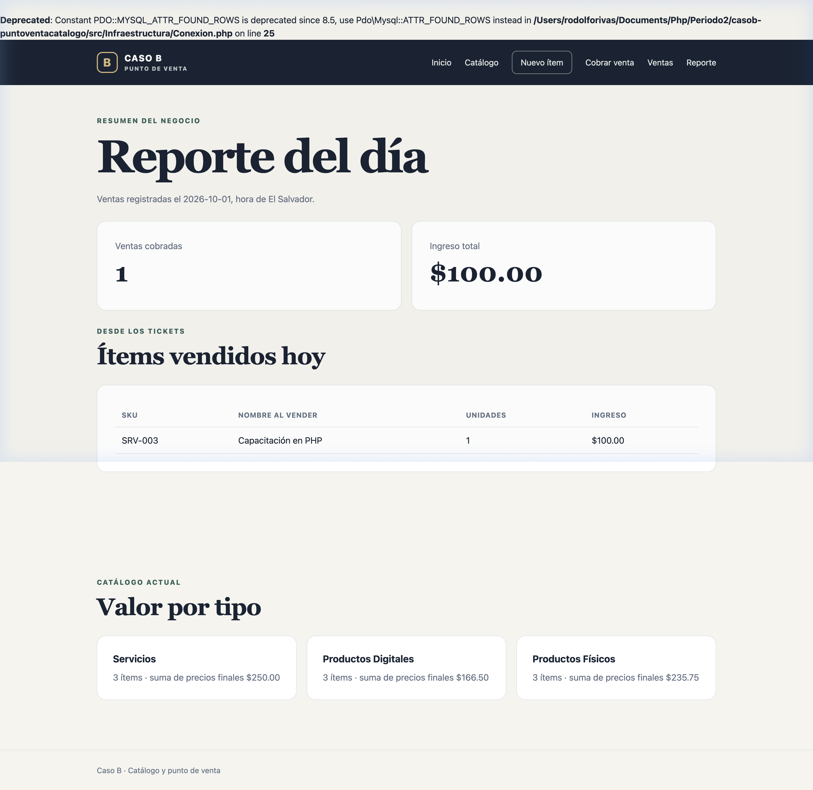

# casob-puntoventacatalogo

Sistema de **Punto de Venta y Catálogo Web** desarrollado en PHP con Programación Orientada a Objetos. Gestiona un catálogo de productos y servicios, registra ventas desde el navegador y genera tickets históricos consultables. También conserva la interfaz de consola de la Fase 1.

> **Caso B** — Ejercicio académico (Periodo 2, 2026). Integrantes: Miguel, Diego, Kendel Jhoel, Rodolfo Rivas.

---

## Características

- 🌐 Interfaz web completa: catálogo, alta, edición, borrado, venta, ticket y reporte
- 🛒 Punto de venta con validación de stock y transacción MySQL
- 📦 **Productos Físicos** — con control de stock
- 💻 **Productos Digitales** — sin stock, con enlace de descarga
- 🛠️ **Servicios** — agendables, sin stock
- 🧾 Ticket de compra histórico (no cambia si se edita el catálogo)
- 🔒 CSRF, PRG, escape HTML y consultas preparadas
- 🖥️ Versión de consola interactiva conservada (`php app.php`)

---

## Requisitos

| Herramienta     | Versión mínima |
|-----------------|----------------|
| PHP             | 8.1 o superior |
| MySQL / MariaDB | 8.0 / 10.5     |
| Composer        | 2.x            |

Verifica tus versiones:

```bash
php -v
mysql --version
composer --version
```

---

## Instalación — Aplicación Web

### 1. Clonar el repositorio

```bash
git clone https://github.com/KendelJhoel/casob-puntoventacatalogo.git
cd casob-puntoventacatalogo
```

### 2. Instalar dependencias PHP

```bash
composer install
```

### 3. Configurar la conexión a la base de datos

```bash
cp config/config.example.php config/config.php
```

Abre `config/config.php` y ajusta el host, puerto, nombre de base de datos, usuario y contraseña según tu entorno local.

### 4. Crear la base de datos e importar el esquema

```bash
# Crea la base (si no existe)
mysql -u root -p -e "CREATE DATABASE IF NOT EXISTS casob_puntoventa CHARACTER SET utf8mb4 COLLATE utf8mb4_unicode_ci;"

# Importa el esquema (crea las tablas desde cero)
mysql -u root -p casob_puntoventa < database/schema.sql

# Importa los datos de ejemplo (9 ítems: 3 físicos, 3 digitales, 3 servicios)
mysql -u root -p casob_puntoventa < database/seed.sql
```

### 5. Levantar el servidor de desarrollo

```bash
php -S localhost:8000 -t public
```

### 6. Navegar la aplicación

Abre tu navegador en `http://localhost:8000` y explora los módulos:

| Ruta              | Módulo                    |
|-------------------|---------------------------|
| `index.php`       | Inicio / resumen          |
| `catalogo.php`    | Listado del catálogo      |
| `crear.php`       | Alta de ítem              |
| `editar.php?id=N` | Edición de ítem           |
| `detalle.php?id=N`| Ficha completa del ítem   |
| `eliminar.php?id=N`| Confirmación de borrado  |
| `venta_nueva.php` | Registrar una venta       |
| `ventas.php`      | Historial de ventas       |
| `venta.php?id=N`  | Ticket de una venta       |
| `reporte.php`     | Reporte del día           |

---

## Instalación — Versión Consola (Fase 1)

Solo requiere PHP y Composer (sin MySQL):

```bash
composer install
php app.php
```

### Navegación del menú

| Tecla | Acción                           |
|-------|----------------------------------|
| `A`   | Agregar un ítem al carrito       |
| `C`   | Cobrar y emitir ticket de compra |
| `L`   | Limpiar el carrito               |
| `S`   | Salir del sistema                |

El ticket se guarda en `tickets/ticket_XXXXXXXX.txt`.

---

## Capturas de pantalla

| Módulo | Vista |
|--------|-------|
| Inicio |  |
| Catálogo |  |
| Alta de ítem |  |
| Edición de ítem |  |
| Ficha de ítem |  |
| Nueva venta |  |
| Historial de ventas |  |
| Ticket de venta |  |
| Reporte del día |  |

---

## Estructura del proyecto

```
casob-puntoventacatalogo/
├── app.php                          # Punto de entrada consola
├── main.php                         # Catálogo de ejemplo para consola
├── composer.json
├── config/
│   ├── config.example.php           # Plantilla de configuración (versionar)
│   └── config.php                   # Configuración local (ignorada por Git)
├── database/
│   ├── schema.sql                   # Crea tablas desde cero
│   └── seed.sql                     # Datos de ejemplo (3 por tipo)
├── public/                          # Raíz web (apuntar aquí el servidor)
│   ├── index.php                    # Inicio
│   ├── catalogo.php
│   ├── crear.php / editar.php / detalle.php / eliminar.php
│   ├── venta_nueva.php / ventas.php / venta.php / reporte.php
│   ├── _init.php                    # Bootstrap: PDO, sesión, helpers
│   ├── _layout.php                  # Cabecera y pie HTML compartidos
│   ├── _formulario_item.php         # Partial del formulario de ítems
│   ├── assets/
│   │   ├── styles.css               # Hoja de estilos propia
│   │   ├── forms.js                 # Lógica JS del formulario
│   │   └── sin-imagen.svg           # Imagen por defecto
│   └── uploads/                     # Imágenes subidas (ignoradas por Git)
├── src/
│   ├── Contratos/Facturable.php
│   ├── Excepciones/StockInsuficienteException.php
│   ├── Infraestructura/             # Conexión PDO
│   ├── Modelos/                     # ItemVendible, ProductoFisico, etc.
│   ├── Repositorios/                # RepositorioItems, RepositorioVentas
│   └── Servicios/                   # Carrito, GestorImagenes, ItemFactory, Validador
├── tests/                           # Scripts de comprobación
└── tickets/                         # Tickets de consola (.txt, ignorados por Git)
```

---

## Autoloading

El proyecto usa **PSR-4** vía Composer. El namespace raíz `App\` mapea a `src/`:

```json
"autoload": {
    "psr-4": {
        "App\\": "src/"
    }
}
```

Si agregas nuevas clases, regenera el autoloader:

```bash
composer dump-autoload
```

---

## Integrantes

| Nombre        | Rama      | Responsabilidad principal                     |
|---------------|-----------|-----------------------------------------------|
| Miguel        | `Miguel`  | Fase 1 — Modelo POO, BD y repositorio         |
| Diego         | `Diego`   | Fase 1 — Interfaz web, imágenes               |
| Kendel Jhoel  | `ken`     | Fase 2 — Ventas, ticket y reporte             |
| Rodolfo Rivas | `Rodolfo` | Fase 3 — Verificación, README e informe final |
